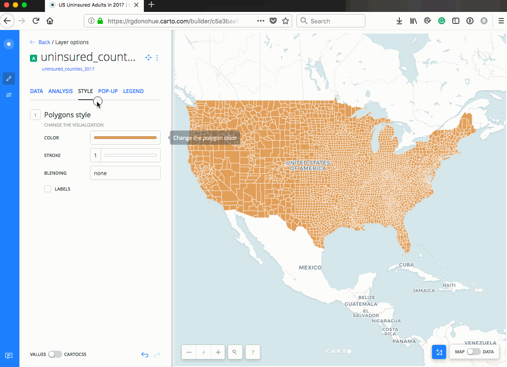
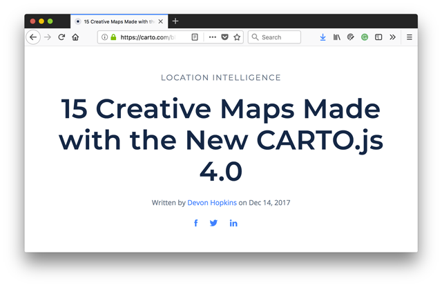
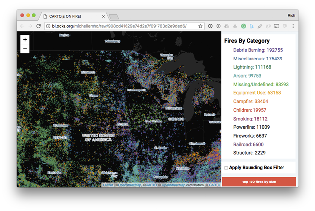

# Lab 06: Toward a final project and playing with CARTO

## TOC

* [Part I. Your final project's topic, objectives, and data (**3 pts**)](#part-i-your-final-projects-topic-objectives-and-data-3-pts)
  + [1. Data source](#1-data-source)
  + [2. Topic and geographic phenomena your map will explore](#2-topic-and-geographic-phenomena-your-map-will-explore)
  + [3. Map objectives and user needs](#3-map-objectives-and-user-needs)
* [Part II. Making your own map with CARTO.js 4.0 (**4 pts**)](#part-ii-making-your-own-map-with-cartojs-40-4-pts)
  + [1. CARTO.js 4.0 examples](#1-cartojs-40-examples)
  + [2. Understanding how to use Gist/Blocks examples](#2-understanding-how-to-use-gistblocks-examples)

## Part I. Your final project's topic, objectives, and data (**3 pts**)

It's time to start thinking carefully about your final map project for MAP673. Using the process covered in Modules 04 &amp; 05, the deliverable for this week will include three pieces:

1. your **data source** and (at least a sample of) the data required to meet the map's objectives
2. the **map topic** and geographic phenomena your map will explore
2. articulation of the **map's objectives** and **user needs**

Write thoughtful answers to the following questions within a markdown file named *topic-objectives.md* and commit to your map673-module-06-*username* repository.

### 1. Data source

This one is crucial. Sometimes we have high goals and ideas for a map. But if we can't easily and quickly get the data in a fast-paced class like this we don't leave ourselves much time for the design and development phases. Demonstrate access to your data, or very minimally some ugly data that we can consider strategies for refining and cleaning up (though I recommend you begin the data wrangling immediately).

Provide me with: 1.) your anticipated data source and 2.) a small sample of the data (e.g., CSV/GeoJSON/Shapefile or a URL link to an accessible database). I need to be able to look at the data to give you quality feedback concerning your overall map objectives and what we can achieve in the next four weeks.

Still shopping for a topic? Consider looking through these open data resources for ideas and inspiration:

* https://data.world/
* https://www.data.gov/
* http://data.opengeoportal.org/
* http://www.naturalearthdata.com/downloads/
* https://www.census.gov/geo/maps-data/data/tiger-cart-boundary.html
* https://hub.arcgis.com/pages/open-data
* https://earthexplorer.usgs.gov/
* http://overpass-turbo.eu/
* https://download.geofabrik.de/
* http://sedac.ciesin.columbia.edu/
* http://www.opentopography.org/
* http://data.opengeoportal.org/
* http://krdc.uky.edu/data-products

Reach out for help ASAP! Let me know what you're looking at or ask your course team members for advice on Slack or a Canvas discussion post. Most importantly, think about data and a map that you'll have fun making and that you'll be eager to share with those who are important to you.

### 2. Topic and geographic phenomena your map will explore

What are you mapping? Briefly describe the topic and the geography the map intends to represent. Also, provide a tentative title (and possibly a subtitle) for your map. Remember that good titles, while being provocative and potentially fun, also tell a user three things: 1.) **what** is being mapped, 2.) the spatial or geographical location of the mapped phenomena (**where**), and 3.) **when** the phenomena occurred.

### 3. Map objectives and user needs

* Answer the question,  "Why are you making this map?" Consider your position to the map. If your design is to bridge a purpose with a format (in this case a web map), why are you the one to be designing it?
* Create a brief user persona and tell us why this person is using your map. How would you characterize them in terms of their expertise and motivation (i.e., novice/public, average, expert/domain-specific). Give them a name and tell us about their emotional reaction when engaging with your interface.
* Imagine a scenario. It need not cover all potential use cases, but it should describe some possible actions users may take meet their objectives (i.e., filtering the data, searching for an address, changing the attribute with a drop-down menu). Use Roth's interaction operators (Module 04/05) to describe these human-computer interactions (HCIs) better.

## Part II. Making your own map with CARTO.js 4.0 (**4 pts**)

Part II of this lab invites you to explore the CARTO.js 4.0 library further. Create a new HTML file: **lab-06/index.html**. You'll build your map within this page using CARTO.js version 4.0. But first, read the two sections below.

You should begin by (quickly!) establishing a dataset or two with which you'd like to experiment. You'll want to upload these to your CARTO account. You may also wish to look within CARTO's [Data Library](https://carto.com/data-library) of existing datasets (you can "connect to" these datasets while logged into your account and import the data directly into your account datasets).

However, if you do use the Data Library, note that 1.) it doesn't appear to have been updated recently, and 2.) some of the datasets it contains are quite large. Recognize that your account likely has a size limit for storage (this goes for data you may wish to upload as well).

Note that you may wish to experiment with your data within the BUILDER interface when logged into your CARTO account (choose to "Create Map" when in the dataset view). In particular, note how you can access the CartoCSS rules within the interface for cutting and pasting into your script (especially if you choose to pursue a thematic map).

  
**Figure 01.** Finding the CartoCSS rules within Builder.

You may also find these posts inspiring or helpful:

* [Styling a custom basemap](https://carto.com/learn/guides/styling/styling-a-custom-basemap/#custom-fill-properties)
* [Basemaps for rendering map backgrounds](https://carto.com/learn/guides/styling/basemaps-for-rendering-map-backgrounds/)
* [Changing map projections](https://carto.com/learn/guides/data-and-sql/changing-map-projections/#adding-a-projection-to-your-account)
* [Choropleth map for statistical data](https://carto.com/learn/guides/styling/choropleth-map-for-statistical-data/)
* [Styling with TurboCarto](https://carto.com/blog/styling-with-turbo-carto/)

As well as all the beautiful CARTOColor Schemes for use with TurboCarto: [CARTOColor Scheme Names](https://github.com/CartoDB/CartoColor/wiki/CARTOColor-Scheme-Names).


### 1. CARTO.js 4.0 examples

Have a look at the [CARTO.js 4.0 examples](https://carto.com/documentation/cartojs/examples/) and consider integrating one into your map. Experts write these examples with some bleeding edge ES6 skills (unfortunately the examples lack comments). Copy the scripts into your editor, modify the code to see the results, and try to figure out how they're working. Then post to the Canvas Discussion board with questions. Feel free to share tips, tricks, or insights you gain.

In particular, study the examples in the [Change the source](https://carto.com/documentation/cartojs/examples/#example-change-the-source) example and the [Change the style](https://carto.com/documentation/cartojs/examples/#example-change-the-style) example to build some basic interactivity in your map allowing the user to change the represented data with a UI element (such as a button).

The [Legends](https://carto.com/documentation/cartojs/examples/#example-legends) example is also worth perusing.

### 2. Understanding how to use Gist/Blocks examples

Late last year CARTO held a Hackathon and challenged participants to do what they could with the new library in three hours. The examples are accessible through a blog post titled 15 Creative Maps Made with CARTO.js 4.0](https://carto.com/blog/creative-maps-carto-js-4/).

  
**Figure 02.** 15 Creative Maps Made with CARTO.js 4.0.

It's worth at least glancing through the examples, as their topics and data sources are exciting and potentially valuable. The blog post links to these, but it's not immediately evident how you can access the code used to produce them. Let's take one of the first as an example. Follow the URL link to the map about US fires:

http://bl.ocks.org/michellemho/raw/908cd41629e74d2e7f091763d2e9ded6/

  
**Figure 03.** Map of US Fires Made with CARTO.js 4.0.

Enjoy the map for a little bit but then notice the URL:

```text
http://bl.ocks.org/michellemho/raw/908cd41629e74d2e7f091763d2e9ded6/
```

You've likely run across [bl.ocks](http://bl.ocks.org) before. In short, the application powering bl.ocks.org runs scripts on the backend to scrap public Gists from GitHub and display the files and resultant map or data visualization. 

[What's a Gist](https://help.github.com/articles/about-gists/)? Gists are simple repositories hosted by GitHub and intended to be simple examples, rather than full-fledged repositories. They're still repositories though and can be cloned or forked.

For instance, the Gist of the fires map referenced above is hosted here (note the URL, which contains the username and the Gist ID):

https://gist.github.com/michellemho/908cd41629e74d2e7f091763d2e9ded6

Bl.ocks are great for showing the full page of a well-formatted Gist, but you can also see the rendered product with the files by removing the "raw/" part of the URL:

* http://bl.ocks.org/michellemho/908cd41629e74d2e7f091763d2e9ded6/

If we follow this link, we're able to see all the code used to produce the map, in this case conveniently contained within a single webpage.

  
**Figure 04.** Block of fire map.

Gists and blocks are a useful way to share and find examples and coding solutions. While you can study the code within the webpage, because these are GitHub repositories, you're also able to clone them down, open them in your local development environment, and test the code yourself (eventually copying and modifying parts into your own scripts).